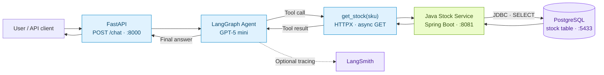
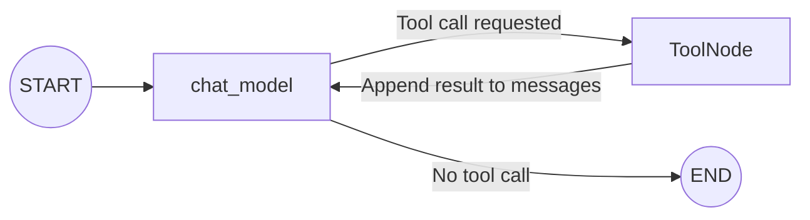

<div align="center">

# Customer Assistant Agent

### One question. One tool call. Live stock data.

A LangGraph-powered customer assistant that queries inventory through a Java microservice.


[Architecture](#architecture) · [Quick start](#quick-start) · [API](#api) · [Roadmap](#current-scope-and-roadmap)

</div>

---

> **User:** “Is SKU-001 in stock?”<br>
> **Assistant:** Calls the stock tool, retrieves the current quantity from PostgreSQL, and uses that data to answer.

This small application demonstrates how an LLM uses a tool to interact with a separate backend service. Python handles the conversation and tool workflow; Java manages access to inventory data.

| 💬 Conversation | 🔧 Tool calling | 📦 Stock service | 🔎 Observability |
| :--- | :--- | :--- | :--- |
| Send messages through FastAPI | The agent calls `get_stock` when needed | Access PostgreSQL with Spring Boot + JDBC | Optional LangSmith tracing |

## Architecture



The agent loop:



`bind_tools` makes tools available to the model. `ToolNode` executes the selected tool, and the model uses its result to produce a final answer. Each `/chat` request starts with a fresh message history; conversation memory across requests is not implemented yet.

## Quick start

**Prerequisites:** Python 3.13+, [uv](https://docs.astral.sh/uv/getting-started/installation/), Java 21, Maven, a running Docker/OrbStack instance, and an OpenAI API key.

### 1 · Set up the project

```bash
git clone git@github.com:gocenalper/customer-assistant-agent.git
cd customer-assistant-agent
uv sync --locked
cp .env.example .env
```

Replace `OPENAI_API_KEY` in `.env` with your own key. This file is excluded from Git.

### 2 · Start PostgreSQL and the Java service

From the project root, in your first terminal:

```bash
cd stock-service
docker compose up -d
mvn spring-boot:run
```

The Java application creates the `stock` table on startup. PostgreSQL data persists in a Docker volume; the table is empty on a fresh installation.

### 3 · Add sample products

Once the Java service has started, open a second terminal at the project root:

```bash
docker compose -f stock-service/compose.yaml exec -T postgres \
  psql -v ON_ERROR_STOP=1 -U stock -d stockdb <<'SQL'
INSERT INTO stock (sku, name, quantity) VALUES
    ('SKU-001', 'Mechanical Keyboard', 25),
    ('SKU-002', 'Wireless Mouse', 40),
    ('SKU-003', '27-inch Monitor', 12),
    ('SKU-004', 'USB-C Hub', 18),
    ('SKU-005', 'Bluetooth Headphones', 0)
ON CONFLICT (sku) DO NOTHING;
SQL
```

Running this command again leaves existing products unchanged, including their names and quantities. `SKU-005` starts with zero stock to demonstrate an out-of-stock response.

### 4 · Start the Python API

From the project root:

```bash
uv run uvicorn api.service:app --reload
```

| Service | Address |
| :--- | :--- |
| FastAPI Swagger UI | [localhost:8000/docs](http://localhost:8000/docs) |
| Stock list | [localhost:8081/stocks](http://localhost:8081/stocks) |
| Single product | [localhost:8081/stocks/SKU-001](http://localhost:8081/stocks/SKU-001) |
| PostgreSQL | `localhost:5433` · database: `stockdb` |

## API

### Ask the assistant

```bash
curl -X POST http://localhost:8000/chat \
  -H 'Content-Type: application/json' \
  -d '{"message":"Is SKU-001 in stock?"}'
```

Example response; the exact wording may vary:

```json
{
  "response": "The Mechanical Keyboard is in stock. There are 25 units available."
}
```

### Query the stock service directly

```bash
curl http://localhost:8081/stocks/SKU-001
```

```json
{
  "sku": "SKU-001",
  "name": "Mechanical Keyboard",
  "quantity": 25
}
```

| Method | Endpoint | Behavior |
| :--- | :--- | :--- |
| `POST` | `/chat` | Accepts a `message` and returns the agent's answer in `response` |
| `GET` | `/stocks` | Returns all stock records, or `[]` when empty |
| `GET` | `/stocks/{sku}` | Returns one product, or `404` if not found |

The `get_stock` tool queries by SKU. Product-name search is not implemented yet.

## Project structure

```text
customer-assistant-agent/
├── api/
│   ├── service.py          # FastAPI /chat endpoint
│   └── model.py            # UserMessage, LLMResponse, StockInfo
├── graph/
│   └── agent.py            # Model, state, and tool loop
├── tools/
│   └── toolset.py          # get_stock and TOOLSET
├── stock-service/
│   ├── src/main/java/      # Spring Boot application and stock endpoints
│   ├── src/main/resources/
│   │   ├── application.properties
│   │   └── schema.sql      # Single stock table
│   ├── compose.yaml        # PostgreSQL
│   └── pom.xml
├── .env.example            # Environment template without credentials
├── pyproject.toml
└── uv.lock
```

## Configuration

Python loads the project-root `.env` file through `load_dotenv()`:

| Variable | Purpose | Default / requirement |
| :--- | :--- | :--- |
| `OPENAI_API_KEY` | GPT-5 mini calls | Required |
| `STOCK_SERVICE_URL` | Java service address | `http://localhost:8081` |
| `LANGSMITH_TRACING` | Send agent and tool traces | `false` in the example file |
| `LANGSMITH_API_KEY` | LangSmith access | Required when tracing is enabled |
| `LANGSMITH_PROJECT` | Project for collected traces | `customer-assistant-agent` |

To use LangSmith, set tracing to `true` and add your key. For the EU region, set `LANGSMITH_ENDPOINT=https://eu.api.smith.langchain.com`. Keys associated with multiple workspaces also require `LANGSMITH_WORKSPACE_ID`. When tracing is enabled, messages and tool results are sent to LangSmith. [LangGraph tracing setup](https://docs.langchain.com/langsmith/trace-with-langgraph)

The Java service accepts `DB_URL`, `DB_USER`, `DB_PASSWORD`, and `PORT` environment variables. Java does not automatically read the project-root `.env` file; provide these values in the Java process environment. See the [Stock Service README](stock-service/README.md) for details.

## Current scope and roadmap

- [x] Assistant endpoint through FastAPI
- [x] Asynchronous model → tool → model loop with LangGraph
- [x] SKU-based stock queries backed by PostgreSQL
- [x] Pydantic stock-response validation, with validation failures returned as tool results
- [x] Optional LangSmith tracing configuration
- [ ] Tool error handling for HTTP errors, connection failures, and invalid JSON
- [ ] Product-name search
- [ ] User authentication and API authorization
- [ ] A database account with read-only stock access
- [ ] Refund tool with ownership checks, eligibility rules, approval, and duplicate-refund protection

> **Development scope:** The APIs do not currently require authentication. In the local setup, the Java service connects with an administrative account that can create tables; GET endpoints do not make that database account read-only. Refunds are not implemented yet. Default database credentials are intended for local development.
