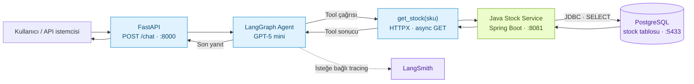
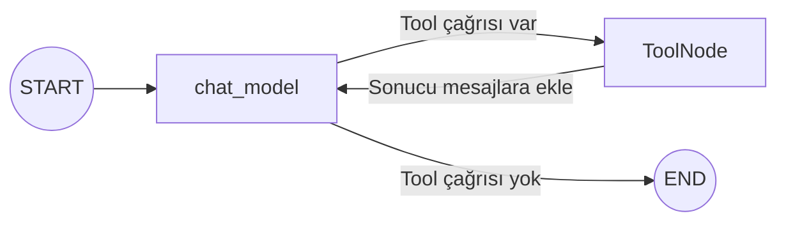

<div align="center">

# Customer Assistant Agent

### Bir soru. Bir tool çağrısı. Gerçek stok verisi.

LangGraph ile çalışan, Java mikroservisinden stok sorgulayan müşteri asistanı.


[Mimari](#mimari) · [Hızlı başlangıç](#hızlı-başlangıç) · [API](#api) · [Yol haritası](#yol-haritası)

</div>

---

> **Kullanıcı:** “SKU-001 stokta var mı?”<br>
> **Asistan:** Stok tool'unu çağırır, PostgreSQL'deki güncel miktarı alır ve yanıtını bu veriye dayanarak oluşturur.

Bu proje, bir LLM'in tool kullanarak ayrı bir backend servisiyle nasıl çalıştığını gösteren küçük bir uygulamadır. Python tarafı konuşma ve tool akışını; Java tarafı stok verisine erişimi yönetir.

| 💬 Konuşma | 🔧 Tool kullanımı | 📦 Stok servisi | 🔎 İzlenebilirlik |
| :--- | :--- | :--- | :--- |
| FastAPI üzerinden mesaj gönder | Agent gerektiğinde `get_stock` çağırır | Spring Boot + JDBC ile PostgreSQL'e eriş | İsteğe bağlı LangSmith tracing |

## Mimari



Agent içindeki döngü:



`bind_tools`, kullanılabilir tool'ları modele tanıtır. `ToolNode` seçilen tool'u çalıştırır; model sonucu görerek son yanıtını üretir. Her `/chat` isteği yeni mesaj geçmişiyle başlar; istekler arasında konuşma hafızası henüz yoktur.

## Hızlı başlangıç

**Gerekenler:** Python 3.13+, [uv](https://docs.astral.sh/uv/getting-started/installation/), Java 21, Maven, çalışan Docker/OrbStack ve bir OpenAI API anahtarı.

### 1 · Projeyi hazırla

```bash
git clone git@github.com:gocenalper/customer-assistant-agent.git
cd customer-assistant-agent
uv sync --locked
cp .env.example .env
```

`.env` içindeki `OPENAI_API_KEY` değerini kendi anahtarınla değiştir. Bu dosya Git'e dahil edilmez.

### 2 · PostgreSQL ve Java servisini başlat

Proje kökünden, ilk terminalde:

```bash
cd stock-service
docker compose up -d
mvn spring-boot:run
```

Java uygulaması açılışta `stock` tablosunu oluşturur. PostgreSQL verileri Docker volume'ünde saklanır; tablo ilk kurulumda boştur.

### 3 · Örnek ürünleri ekle

Java servisi açıldıktan sonra, proje kökünde ikinci bir terminalde:

```bash
docker compose -f stock-service/compose.yaml exec -T postgres \
  psql -v ON_ERROR_STOP=1 -U stock -d stockdb <<'SQL'
INSERT INTO stock (sku, name, quantity) VALUES
    ('SKU-001', 'Mekanik Klavye', 25),
    ('SKU-002', 'Kablosuz Mouse', 40),
    ('SKU-003', '27 inç Monitör', 12),
    ('SKU-004', 'USB-C Hub', 18),
    ('SKU-005', 'Bluetooth Kulaklık', 0)
ON CONFLICT (sku) DO NOTHING;
SQL
```

Aynı komutu tekrar çalıştırmak mevcut ürün miktarlarını değiştirmez. `SKU-005`, stok tükenmesi senaryosu için sıfır miktarla eklenir.

### 4 · Python API'yi başlat

Proje kökünde:

```bash
uv run uvicorn api.service:app --reload
```

| Servis | Adres |
| :--- | :--- |
| FastAPI Swagger | [localhost:8000/docs](http://localhost:8000/docs) |
| Stok listesi | [localhost:8081/stocks](http://localhost:8081/stocks) |
| Tek ürün | [localhost:8081/stocks/SKU-001](http://localhost:8081/stocks/SKU-001) |
| PostgreSQL | `localhost:5433` · veritabanı: `stockdb` |

## API

### Asistana sor

```bash
curl -X POST http://localhost:8000/chat \
  -H 'Content-Type: application/json' \
  -d '{"message":"SKU-001 stokta var mı?"}'
```

Örnek yanıt; ifade modelin ürettiği cevaba göre değişebilir:

```json
{
  "response": "Mekanik Klavye stokta mevcut. 25 adet bulunuyor."
}
```

### Stok servisine doğrudan eriş

```bash
curl http://localhost:8081/stocks/SKU-001
```

```json
{
  "sku": "SKU-001",
  "name": "Mekanik Klavye",
  "quantity": 25
}
```

| Metot | Endpoint | Davranış |
| :--- | :--- | :--- |
| `POST` | `/chat` | `message` alır, agent yanıtını `response` alanında döndürür |
| `GET` | `/stocks` | Stok listesini döndürür; kayıt yoksa `[]` |
| `GET` | `/stocks/{sku}` | Tek ürünü döndürür; bulunamazsa `404` |

`get_stock` tool'u SKU ile sorgular. Ürün adına göre arama henüz uygulanmamıştır.

## Proje yapısı

```text
customer-assistant-agent/
├── api/
│   ├── service.py          # FastAPI /chat endpoint'i
│   └── model.py            # UserMessage, LLMResponse, StockInfo
├── graph/
│   └── agent.py            # Model, state ve tool döngüsü
├── tools/
│   └── toolset.py          # get_stock ve TOOLSET
├── stock-service/
│   ├── src/main/java/     # Spring Boot uygulaması ve stok endpoint'leri
│   ├── src/main/resources/
│   │   ├── application.properties
│   │   └── schema.sql      # Tek stock tablosu
│   ├── compose.yaml       # PostgreSQL
│   └── pom.xml
├── .env.example           # Anahtarsız ortam ayarı şablonu
├── pyproject.toml
└── uv.lock
```

## Yapılandırma

Python, proje kökündeki `.env` dosyasını `load_dotenv()` ile okur:

| Değişken | Amaç | Varsayılan / gereklilik |
| :--- | :--- | :--- |
| `OPENAI_API_KEY` | GPT-5 mini çağrıları | Gerekli |
| `STOCK_SERVICE_URL` | Java servisinin adresi | `http://localhost:8081` |
| `LANGSMITH_TRACING` | Agent ve tool izlerini gönder | Örnek dosyada `false` |
| `LANGSMITH_API_KEY` | LangSmith erişimi | Tracing açıkken gerekli |
| `LANGSMITH_PROJECT` | İzlerin toplandığı proje | `customer-assistant-agent` |

LangSmith'i kullanmak için tracing'i `true` yapıp anahtarını ekle. EU bölgesinde `LANGSMITH_ENDPOINT=https://eu.api.smith.langchain.com`; birden fazla workspace'e bağlı anahtarlarda `LANGSMITH_WORKSPACE_ID` ayarı gerekir. Tracing açıkken mesajlar ve tool sonuçları LangSmith'e gönderilir. [LangGraph tracing kurulumu](https://docs.langchain.com/langsmith/trace-with-langgraph)

Java servisi `DB_URL`, `DB_USER`, `DB_PASSWORD` ve `PORT` ortam değişkenleriyle yapılandırılabilir. Java, kökteki `.env` dosyasını otomatik okumaz; bu değerleri Java sürecinin ortamına vermelisin. Ayrıntılar: [Stock Service README](stock-service/README.md).

## Mevcut kapsam ve yol haritası

- [x] FastAPI üzerinden asistan endpoint'i
- [x] LangGraph ile asenkron model → tool → model döngüsü
- [x] PostgreSQL'den SKU bazlı stok sorgulama
- [x] Pydantic ile stok yanıtını doğrulama ve doğrulama hatasını tool sonucu olarak döndürme
- [x] İsteğe bağlı LangSmith tracing yapılandırması
- [ ] HTTP hataları, bağlantı kesintileri ve geçersiz JSON için tool hata yönetimi
- [ ] Ürün adına göre arama
- [ ] Kullanıcı kimliği ve API yetkilendirmesi
- [ ] Stok servisi için yalnızca okuma yetkili veritabanı hesabı
- [ ] Refund tool'u: sipariş sahipliği, uygunluk, onay ve tekrarlı iade koruması

> **Geliştirme kapsamı:** API'lerde henüz kimlik doğrulama yoktur. Java servisi yerel kurulumda tablo oluşturabilen yönetici hesabıyla bağlanır; GET endpoint'leri veritabanı hesabını salt okunur yapmaz. Refund henüz uygulanmamıştır. Varsayılan veritabanı bilgileri yerel geliştirme içindir.
